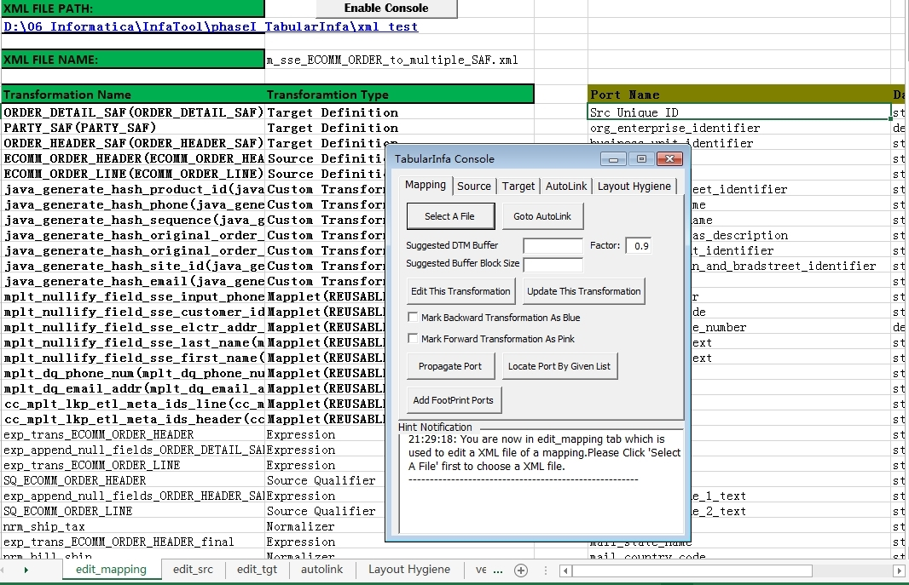
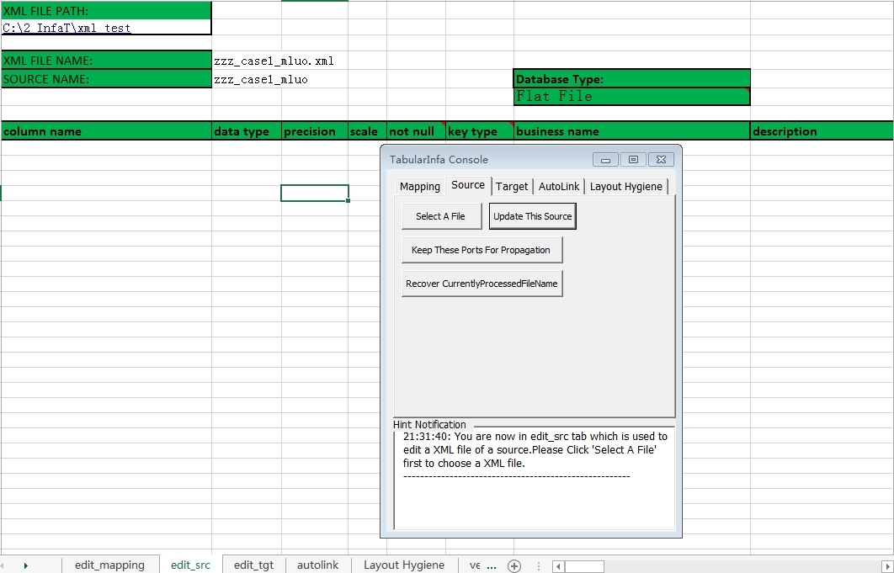
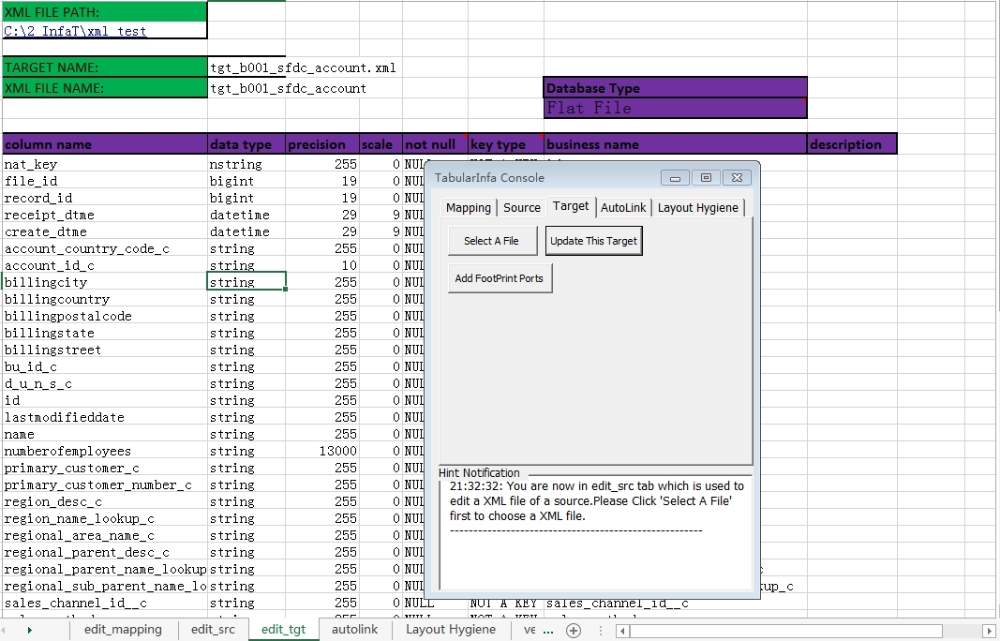
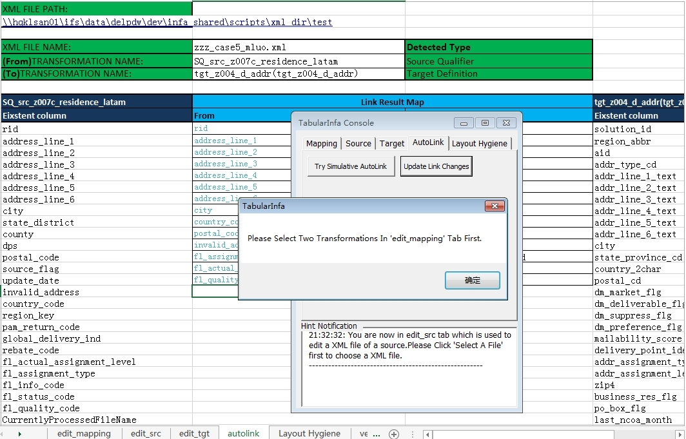

# tabularInfa

- TabularInfa is a useful VBA tool base on Excel.
- You can edit *Informatica exported object*(xml file) quickly via this tool especially for batch operation.
- The MIT License (MIT) Copyright (c) Genghui Luo

## Usage

1. download *tabularInfa.xlsm* and *powrmart.dtd*

  > you can find the proper version of dtd in informatica.
2. double click *tabularInfa.xlsm*, enable macro

## TabularInfa Console

### Mapping
> load a mapping xml, edit it in excel; can work with *autolink*

### Source
> load a source xml, edit it in excel; can work with *Layout Hygiene*

### Target
> load a target xml, edit it in excel; can work with *Layout Hygiene*

### Autolink
> handle links of any two transformations in a loaded mapping

