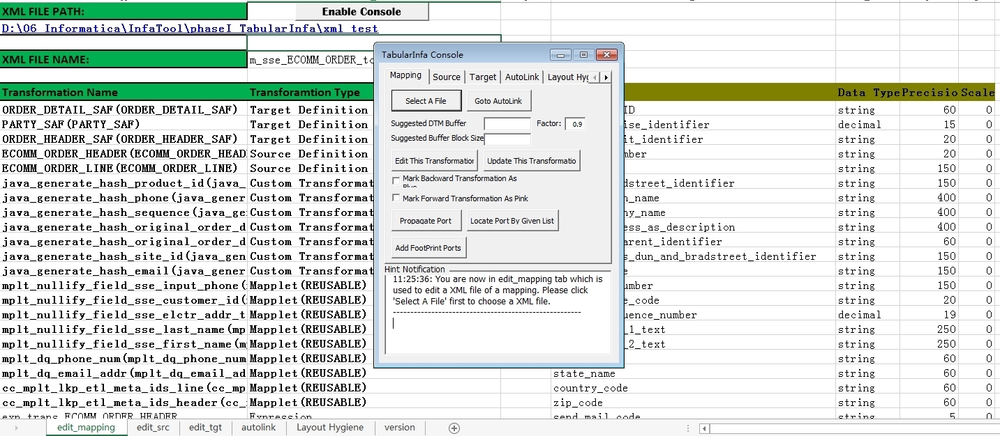

# tabularInfa

- TabularInfa is a useful VBA tool base on Excel.
- You can edit *Informatica exported object*(xml file) quickly via this tool especially for batch operation.
- The MIT License (MIT)
- Copyright (c) Genghui Luo

## TabularInfa console

